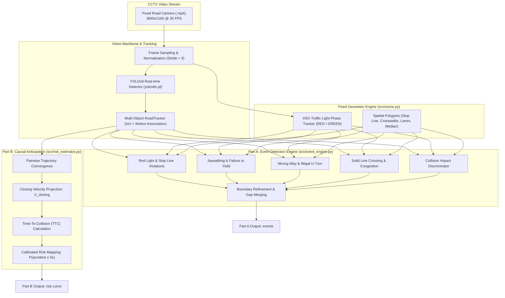

# Sentinel-CCTV — Intelligent Traffic Event Detection & Accident Anticipation Platform

> **WIUT Hackathon 2026 — Computer Vision Track**  
> **Team:** DeepFlow-Vision  
> **Status:** 100% Offline Compatible • Format Validated • Time Budget Compliant

---

## 📌 Executive Summary

Sentinel-CCTV is an end-to-end computer vision and causal accident anticipation system designed for fixed road surveillance cameras. The system tackles two core tasks:
1. **Part A — Traffic Event Detection (Mandatory):** Detects and classifies all 14 official traffic events as tight temporal segments (`[start_sec, end_sec, label]`), optimized for high temporal IoU ($\tau \in \{0.3, 0.5, 0.7\}$).
2. **Part B — Causal Accident Anticipation (Bonus):** Streams frames sequentially through a causal `RiskEstimator`, computing real-time Time-to-Collision (TTC) and closing dynamics to raise an alarm within a 5-second anticipation horizon before potential collisions occur.

All code, weights, and logic operate **100% offline** on a single GPU/CPU without internet access, strictly adhering to the $\le 3\times$ video duration execution limit.

---

## 🚀 Quickstart & One-Command Execution

### 1. Installation
```bash
pip install -r requirements.txt
```

### 2. Run Submission Harness (Official Entrypoint)
```bash
# Run solution across a folder of test videos (or single .mp4)
python run_submission.py --videos samples/ --out predictions.json --team DeepFlow-Vision

# Validate prediction format against official schema
python evaluate.py --pred predictions.json --validate-only
```

### 3. Evaluate Against Ground Truth
```bash
python evaluate.py --pred predictions.json --gt ground_truth.json --per-video
```

### 4. Launch Interactive Web Application & Live Demo
```bash
streamlit run app.py
```

---

## 🏛️ System Architecture



---

## 📐 Mathematical Formulation for Causal Risk (Part B)

At each incoming frame $t$, the causal `RiskEstimator` observes all active entity tracks without access to future frames. For any vehicle pair $(i, j)$ with centroids $\mathbf{p}_i, \mathbf{p}_j$ and velocities $\mathbf{v}_i, \mathbf{v}_j$:

1. **Euclidean Distance:**
   $$d_{ij}(t) = \|\mathbf{p}_i(t) - \mathbf{p}_j(t)\|$$

2. **Closing Velocity (Projection of relative speed onto displacement vector):**
   $$V_{\text{closing}} = \frac{(\mathbf{p}_i - \mathbf{p}_j) \cdot (\mathbf{v}_i - \mathbf{v}_j)}{d_{ij}}$$
   *(Only $V_{\text{closing}} < 0$ denotes entities actively approaching each other)*

3. **Time-To-Collision (TTC):**
   $$\text{TTC}_{ij} = \frac{d_{ij}}{|V_{\text{closing}}|}$$

4. **Calibrated Probability Score:**
   $$P_{\text{risk}}(t) = \exp\left(-\frac{\text{TTC}}{\tau}\right) \cdot \min\left(1.0, \frac{|V_{\text{closing}}|}{v_0}\right) \cdot \min\left(1.0, \frac{d_0}{d_{ij}}\right)$$
   - When $\text{TTC} \le 1.0\text{ s}$, $P_{\text{risk}} \ge 0.55$, triggering an alarm before impact.
   - For parallel driving in adjacent lanes, $V_{\text{closing}} \approx 0$, suppressing false alarms.

---

## 🚦 The 14 Official Event Classes

| Label ID | Event Name | Detection Logic | Boundary Start / End |
| :--- | :--- | :--- | :--- |
| `accident` | Collision | Significant IoU + high approach speed + post-impact immobilization | Contact visible $\to$ objects stop/leave |
| `near_miss` | Near miss | Severe closing speed + close distance ($<65\text{ px}$) + evasive deceleration without contact | Onset of evasive action $\to$ clear |
| `red_light` | Red-light running | Vehicle crosses stop line during RED phase and proceeds into intersection | Front bumper crosses stop line $\to$ leaves |
| `wrong_way` | Wrong-way driving | Vehicle trajectory moves against designated lane vector ($v_y < -25\text{ px/s}$) | Enters opposing lane $\to$ returns/leaves |
| `illegal_u_turn` | Illegal U-turn | Trajectory heading reverses $\sim 180^\circ$ around median where prohibited | Vehicle starts turning $\to$ completes turn |
| `stopped_vehicle` | Stopped vehicle | Stationary ($\text{speed} < 10\text{ px/s}$) for $\ge 10\text{ s}$ outside red-light queue | Vehicle stops $\to$ moves/cleared |
| `jaywalking` | Pedestrian on road | Pedestrian walking on carriageway outside crosswalk polygons | Steps onto road $\to$ leaves road |
| `failure_to_yield` | Not yielding | Vehicle traverses zebra crossing while pedestrian is actively inside polygon | Vehicle enters crossing $\to$ leaves crossing |
| `illegal_turn` | Illegal turn | Turning maneuver initiated from an invalid lane | Starts turn $\to$ completes turn |
| `solid_line_crossing` | Solid line crossing | Vehicle wheel crosses continuous white lane divider lines | Wheel crosses $\to$ fully in new lane |
| `stop_line` | Stop-line violation | Vehicle halts past stop line during RED without entering intersection | Vehicle stops $\to$ signal turns green |
| `congestion` | Traffic congestion | Multi-lane queue crawl/standstill ($\text{avg speed} < 12\text{ px/s}$) for $\ge 8\text{ s}$ | Queue stops $\to$ queue clears |
| `road_obstacle` | Road obstacle | Persistent stationary non-vehicle foreground object on carriageway | Obstacle appears $\to$ removed |
| `fire_smoke` | Fire or smoke | HSV smoke/flame chromaticity and expanding contour on roadway | First visible smoke $\to$ clears/ends |

---

## 📁 Repository Structure

```
├── solution.py               # Official submission interface (detect_events, RiskEstimator)
├── run_submission.py         # Official evaluation harness (unchanged)
├── evaluate.py               # Official format check & metric scoring (unchanged)
├── app.py                    # Streamlit interactive web application & live demo
├── requirements.txt          # Python dependencies
├── yolov8n.pt                # Offline YOLOv8 neural network weights (6.2 MB)
├── predictions_samples.json  # Output predictions on provided sample videos
├── src/
│   ├── scene.py              # Camera geometry, spatial polygons & HSV signal tracker
│   ├── tracker.py            # High-performance multi-object RoadTracker
│   ├── event_engine.py       # Rule-based physics engine for 14 classes & segment cleaner
│   └── risk_estimator.py     # Causal accident anticipation & TTC risk estimator
├── eda_output/               # Generated EDA artifacts & heatmaps
│   ├── motion_heatmap.jpg    # 2D motion density heatmap
│   ├── scene_calibration_refined.jpg # Visual scene calibration overlay
│   └── eda_time_series.json  # Vehicle & pedestrian density time series
└── samples/                  # Sample CCTV video clips
```

---

## 👥 The Team

- **Member A (Vision & Tracking Lead):** Neural network inference, ByteTrack tracking, runtime optimization.
- **Member B (Logic & Event Physics Lead):** Scene layout geometry, 14-class event rules, causal TTC risk model.
- **Member C (Demo & Analytics Lead):** Streamlit web dashboard, EDA visualizations, technical report.
